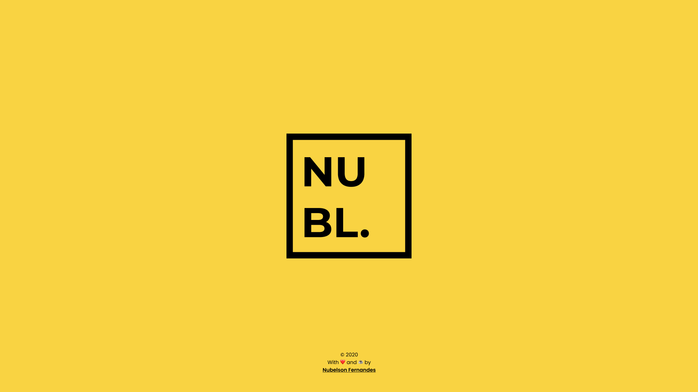

Starting a project from scratch with React is not something developers like so much, you need to learn and configure many construction tools like [Webpack](https://webpack.js.org/), [Babel](https://babeljs.io/) and [ESLint](https://eslint.org/).

To the delight of the developers, Facebook created the [Create React App](https://create-react-app.dev/), a way to create React single-page applications quickly, where you only need to worry about the development of your application since all the construction tools are already configured automatic. While it's a great help, some tools like React Router, Linter, Prettier and Styled-components (because I don't believe you still use .css files) still need to be added and configured and this makes your development unproductive whenever you go develop applications that use the same technologies and configurations. Custom templates can help you with this, they are a way to generate an application with all the tools and settings you need. In this article, you will follow me through the process of developing my own CRA template with Styled-components, Layout and GlobalStyles.

There are currently only 2 official CRA templates:

1. [cra-template](https://github.com/facebook/create-react-app/blob/master/packages/cra-template/README.md) - standard template using Javascript vanilla
2. [cra-template-typescript](https://github.com/facebook/create-react-app/tree/master/packages/cra-template-typescript) - advanced template using Typescript

You can generate the CRA from a template by simply providing the flag —template.
```bash
$ npx create-react-app my-app — template typescript
# or
$ yarn create react-app my-app — template typescript
```


## Creating your own CRA template
The creation of the template will be summarized in 3 steps:

1. Starting a project
2. Removing and adding dependencies and configuration tools
3. Creating the template

After that, we will focus on publishing our template on NPM.

### 1- Starting a project

To start creating your CRA template you need to generate a new project with the standard CRA:

```bash
$ yarn create react-app your-cra-template-name
```

When your project is generated, change the name in your `package.json` to **_cra-template-[your-template-name]_**

> It is important that it starts with the prefix cra-template-, this way the CRA will know that this will be a template.

```json
/* package.json */
{
	"name": "cra-template-nubelsondev",
	"version": "0.1.0",
	"private": true,
	"dependencies": {...},
	"scripts": {...},
	"eslintConfig": {...},
	"browserslist": {
		"production": [...],
		"development": [...]
	}
}
```

### 2- Removing and adding dependencies and configuration tools

Now it's time to configure your template, remove and add the dependencies and settings you need for your template.

> I created a template with **Styled-Components**, **Layout** configuration and GlobalStyles.


Source code [here](https://github.com/nubelsondev/cra-template-nubelsondev/tree/8b8485b1f831718f36712813a3b366acc645e71d).

### 3- Creating the template
When your project is ready to become a template you will need to prepare a few things:

#### 3.1- Create the `template` folder
Create the template folder at the root of your project

```bash
$ mkdir template
```

#### 3.2- Add a `gitignore` file to the` template` folder

Create a gitignore file inside the template folder. You can copy the default CRA gitignore just don't forget to remove the '. 'at the beginning of the file name.

```bash
$ cp .gitignore template/gitignore
```

> It is important that the gitignore file inside the template page is without the ' **.** '! This way the CRA will know that you are creating a template and this will replace this file later. Otherwise you will receive errors in the build.

#### 3.3- Create the `template.json` file at the root of your project

List all the dependencies and added scripts you need in your application created from your template. For example:

```json
{
	"dependencies": {
		"styled-components": "^5.1.0"
	},
	"scripts": {}
}
```

> It is important that you list only the dependencies and scripts that you have added and created.

#### 3.4- Copy the src and public folders to the template folder
```bash
$ cp -a ./src/. template/src && cp -a ./public/. template/public
```

#### 3.5- Copy any configuration files you want to include in your template
> Here you will copy your configuration files as `.eslintignore`, ` .eslintrc`, `.prettierrc`, ` tsconfig.json` and `README.md`.

```bash
$ cp README.md template/
```

## Preparing the template to be published on NPM

### Prepare your `package.json`

Add license, author, description, keywords, repository link, link to report bugs, etc. You can use [my package.json](https://github.com/nubelsondev/cra-template-nubelsondev/blob/master/package.json) as a good example.

### Add the `main` and` files` properties

> It is important to tell CRA where to look for files while generating the application from their template.

```json
{ 
    “main”: “template.json”,
    “files”: [“template”, “template.json”]
}
```

### Creation of a pre-publication script (optional)

> For your convenience I suggest using a pre-publication script to facilitate the process of updating the template

```json
{
    "clean-files": "rm -rf ./template/public ./template/src",
    "copy-files": "cp -a ./src/. template/src && cp -a ./public/. template/public",
    "prepublishOnly": "yarn clean-files && yarn copy-files"
}
```
Add these scripts to your `package.json`


### Publishing your template to NPM

When everything is ready, you can publish your template in NPM, for that you need:

* [Create an account](https://www.npmjs.com/signup) on NPM
* Log in to NPM from the terminal

    At the root of your project, log in to NPM using your credentials
    ```bash
    $ npm login
    ```

* Publish your template (package) with public access
    
    ```bash
    $ npm publish --access public
    ```

> If your package name is already in use, you will receive an error in this step - try another name or package with scope.

When the publication is successful, you can start using it.

```bash
$ npx create-react-app your-project-name --template nubelsondev
# Or
$ yarn create react-app your-project-name --template nubelsondev
```

That's it, so we created and published our own CRA template, now, if you want, you can add Continuous Integration (CI) services like **[Github Actions](https://github.com/features/actions)**, **[Jenkins](https://jenkins.io/)** or **[Travis CI](https://travis-ci.org/)** which by chance would make a good story for a next Blog Post.

See you in the next post, thanks.